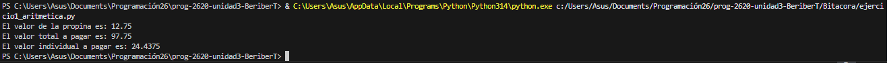
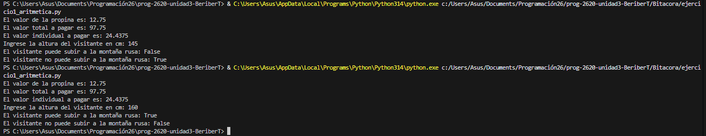
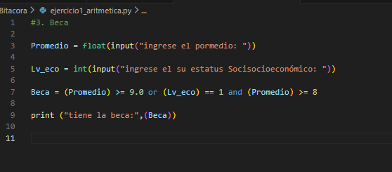

# Bitacora

## ¿Cómo crees que le enseñamos a una computadora a hacer exactamente lo mismo?

        dnehfuieh

## Ejercicio de la cuenta

## Altura M

## Beca

el resultado dunciono asignando la veracidad o falsedad de la acción
