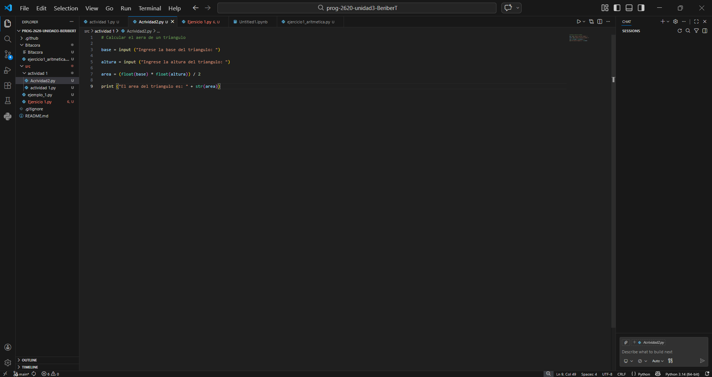
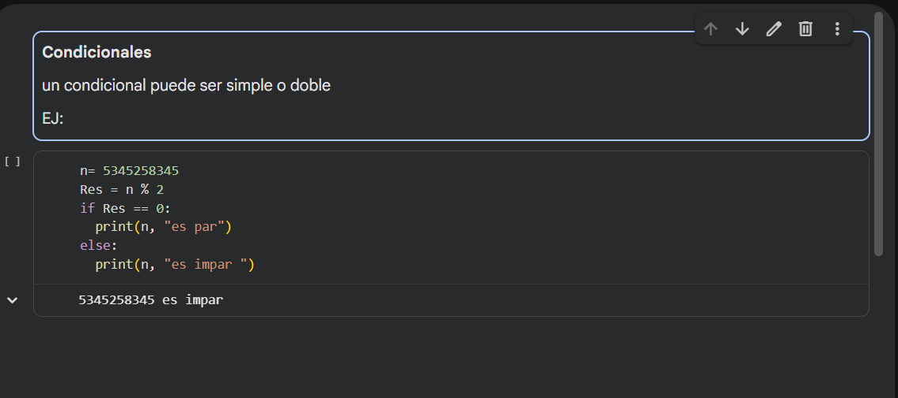
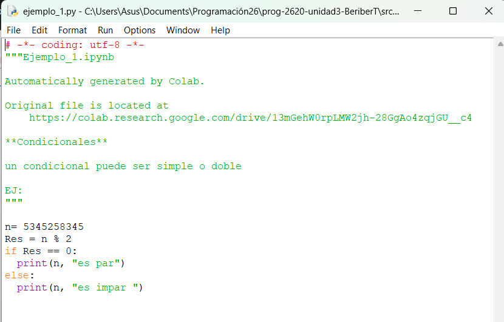

Agrega imágenes (pantallazos) utilizando cada uno de los IDEs vistos en esta actividad.

### Responde las siguientes preguntas con tus propias palabras

1. "¿Qué es un IDE?" 
-"hace referencia a toda clase de herramientas digitales las cuales facilitan el manejo y creacion de codigos"

2. ¿Cuál es la diferencia entre los 3 IDEs estudiados en esta actividad?
- "visual studios: es muy profesional, posee muchos leguajes de programación integrados ( compativilidad con ellos"
- "IDLE: es más sencillo y esta enfocado directamente a pyton"
- "Colab: es una IDE en la nube, con asistencia de la IA, y una gran capacidad de compartir proyectos"

3. ¿Cuál utilizarás en el resto del curso y por qué?

-"Colab, aunque Viual posee un entorno muy agradable, las facilidades de google colab son incomparables almenos en mi opinion"